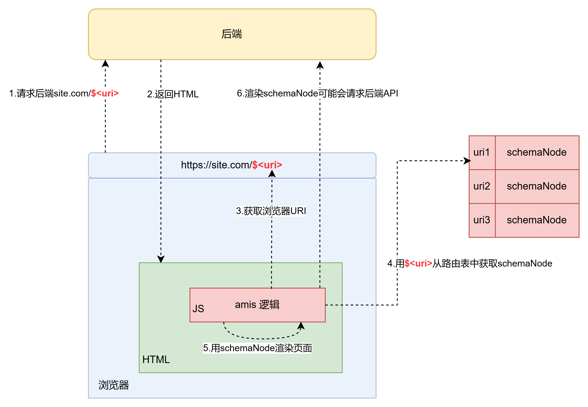

# 目的
使用golang，结合gin框架 和baidu的amis。搭建一个dem，尽量简单无任何非必要逻辑，基于此demo可以扩充业务逻辑。

# 运行
1. git clone https://github.com/ygqwan/amsi-go-gin-demo
2. go mod diy
3. go run main.go
4. 访问 localhost:8080 (需要加载很多大型资源，首次访问很慢)

# 增加路由
在./web/pages/site.json 中注册新的路由, 然后在./web/pages/中新增页面

# 打包
bash build.sh

# amis 多页App架构原理

**一句话描述：** 注意区分`前端PATH`和`后端PATH`，`前端PATH`是为了渲染web页面，`后端PATH是`为了和后端做数据交互。`前端PATH`注册在前端的路由表，`后端PATH`注册在后端的路由表。

**整体原理：**

1. 浏览器请求后端，地址栏中会指定一个路由URI，我们称这个URI为`前端PATH`, 这个`前端PATH`的目的是为了渲染前端页面
2. 后端服务器会将`所有的前端PATH都`返回一个`相同的HTML内容`，至于如何渲染，是HTML中amis 逻辑自闭环。实现上后端会实现一个静态资源服务器，供浏览器读取。
3. 浏览器渲染HTML时会执行到js中amis逻辑，amis框架会拿到浏览器中的URI `前端PATH`
4. 用`前端PATH`在`提前注册好的路由表`中找到对应的`schemaNode`
5. amis 根据schemaNode 中的json内容，完成渲染
6. 在渲染schemaNode时可能会依赖后端的数据，比如渲染表格，需要获取表格中的具体数据，就用请求后端服务，这个API返回常规的业务数据即可; 有如下注意事项：

    1. 前端PATH是浏览器渲染静态页面的PATH
    2. 后端PATH是需要和后端交互业务数据的PATH。
    3. 注意区分请求后端PATH和前端PATH的区别。后端在处理这两类PATH的策略不同：

        1. 后端处理前端PATH，任何PATH都返回相同的HTML内容
        2. 后端处理后端PATH，需要根据业务决定，不限制任何事物。
    4. 注意别将两个PATH搞混了。建议将所有的后端PATH都以`/api`开头。

        1. 前端PATH注册在前端路由表，通常是一个type为app的json
        2. 后端PATH注册在后端路由表